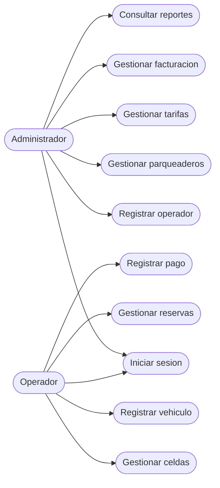
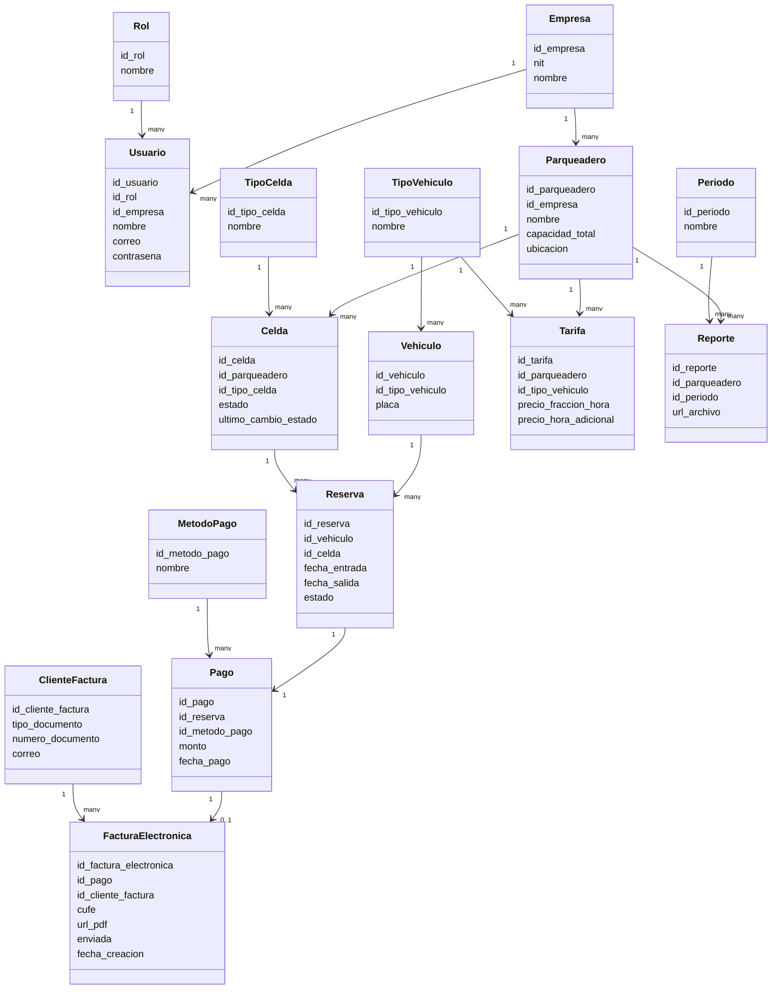
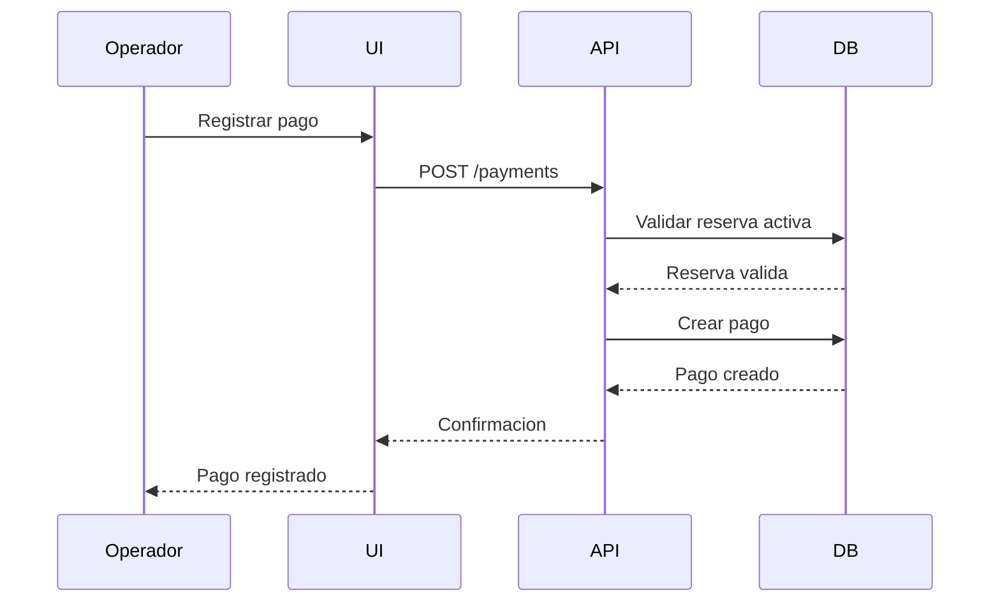

# Diagramas UML

## Diagrama de casos de uso (Mermaid)

```mermaid
flowchart LR
  actorAdmin([Administrador])
  actorOper([Operador])

  ucLogin([Iniciar sesion])
  ucRegOper([Registrar operador])
  ucParq([Gestionar parqueaderos])
  ucCel([Gestionar celdas])
  ucVeh([Registrar vehiculo])
  ucRes([Gestionar reservas])
  ucPago([Registrar pago])
  ucFact([Gestionar facturacion])
  ucTar([Gestionar tarifas])
  ucRep([Consultar reportes])

  actorAdmin --> ucLogin
  actorAdmin --> ucRegOper
  actorAdmin --> ucParq
  actorAdmin --> ucTar
  actorAdmin --> ucFact
  actorAdmin --> ucRep

  actorOper --> ucLogin
  actorOper --> ucCel
  actorOper --> ucVeh
  actorOper --> ucRes
  actorOper --> ucPago
```

## Diagrama de clases (modelo de dominio)

```mermaid
classDiagram
  class Empresa {
    id_empresa
    nit
    nombre
  }
  class Usuario {
    id_usuario
    id_rol
    id_empresa
    nombre
    correo
    contrasena
  }
  class Rol {
    id_rol
    nombre
  }
  class Parqueadero {
    id_parqueadero
    id_empresa
    nombre
    capacidad_total
    ubicacion
  }
  class Celda {
    id_celda
    id_parqueadero
    id_tipo_celda
    estado
    ultimo_cambio_estado
  }
  class TipoCelda {
    id_tipo_celda
    nombre
  }
  class Vehiculo {
    id_vehiculo
    id_tipo_vehiculo
    placa
  }
  class TipoVehiculo {
    id_tipo_vehiculo
    nombre
  }
  class Reserva {
    id_reserva
    id_vehiculo
    id_celda
    fecha_entrada
    fecha_salida
    estado
  }
  class Pago {
    id_pago
    id_reserva
    id_metodo_pago
    monto
    fecha_pago
  }
  class MetodoPago {
    id_metodo_pago
    nombre
  }
  class FacturaElectronica {
    id_factura_electronica
    id_pago
    id_cliente_factura
    cufe
    url_pdf
    enviada
    fecha_creacion
  }
  class ClienteFactura {
    id_cliente_factura
    tipo_documento
    numero_documento
    correo
  }
  class Tarifa {
    id_tarifa
    id_parqueadero
    id_tipo_vehiculo
    precio_fraccion_hora
    precio_hora_adicional
  }
  class Reporte {
    id_reporte
    id_parqueadero
    id_periodo
    url_archivo
  }
  class Periodo {
    id_periodo
    nombre
  }

  Empresa "1" --> "many" Usuario
  Rol "1" --> "many" Usuario
  Empresa "1" --> "many" Parqueadero
  Parqueadero "1" --> "many" Celda
  TipoCelda "1" --> "many" Celda
  TipoVehiculo "1" --> "many" Vehiculo
  Vehiculo "1" --> "many" Reserva
  Celda "1" --> "many" Reserva
  Reserva "1" --> "1" Pago
  MetodoPago "1" --> "many" Pago
  Pago "1" --> "0..1" FacturaElectronica
  ClienteFactura "1" --> "many" FacturaElectronica
  Parqueadero "1" --> "many" Tarifa
  TipoVehiculo "1" --> "many" Tarifa
  Parqueadero "1" --> "many" Reporte
  Periodo "1" --> "many" Reporte
```

## Diagrama de secuencia (pago de reserva)

```mermaid
sequenceDiagram
  participant Operador
  participant UI
  participant API
  participant DB

  Operador->>UI: Registrar pago
  UI->>API: POST /payments
  API->>DB: Validar reserva activa
  DB-->>API: Reserva valida
  API->>DB: Crear pago
  DB-->>API: Pago creado
  API-->>UI: Confirmacion
  UI-->>Operador: Pago registrado
```
