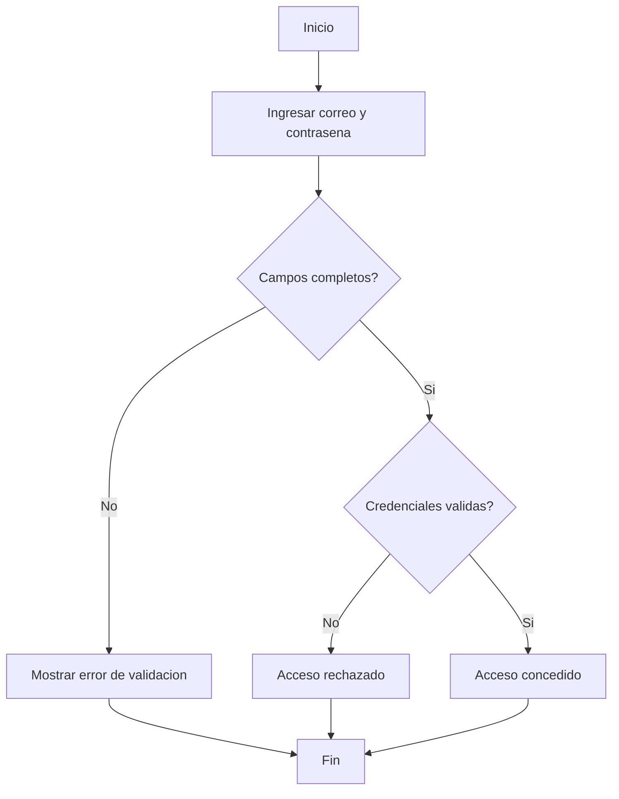
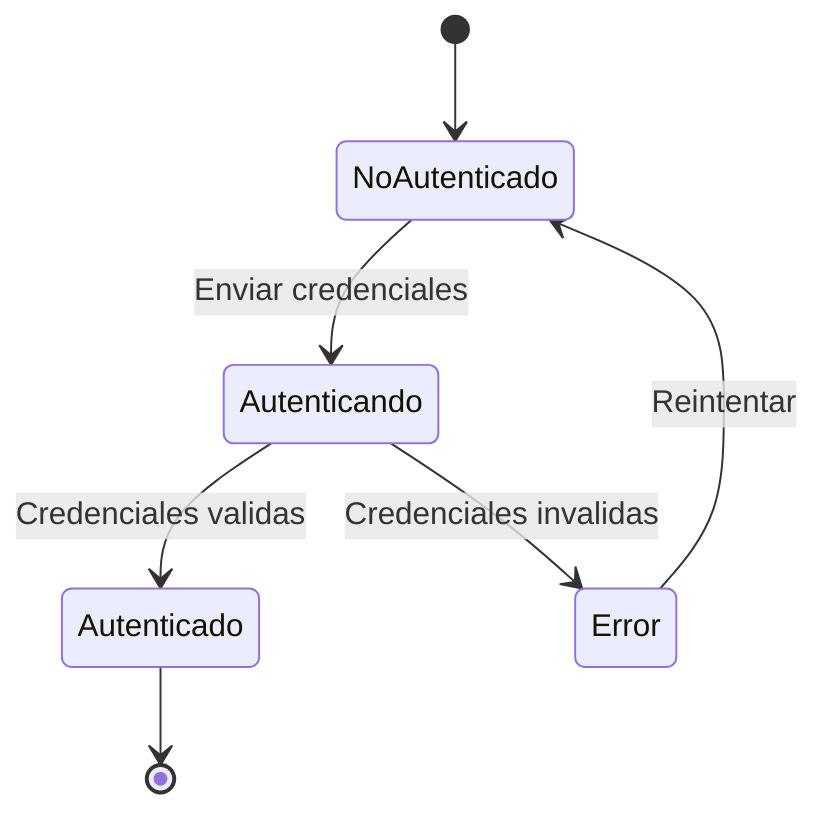
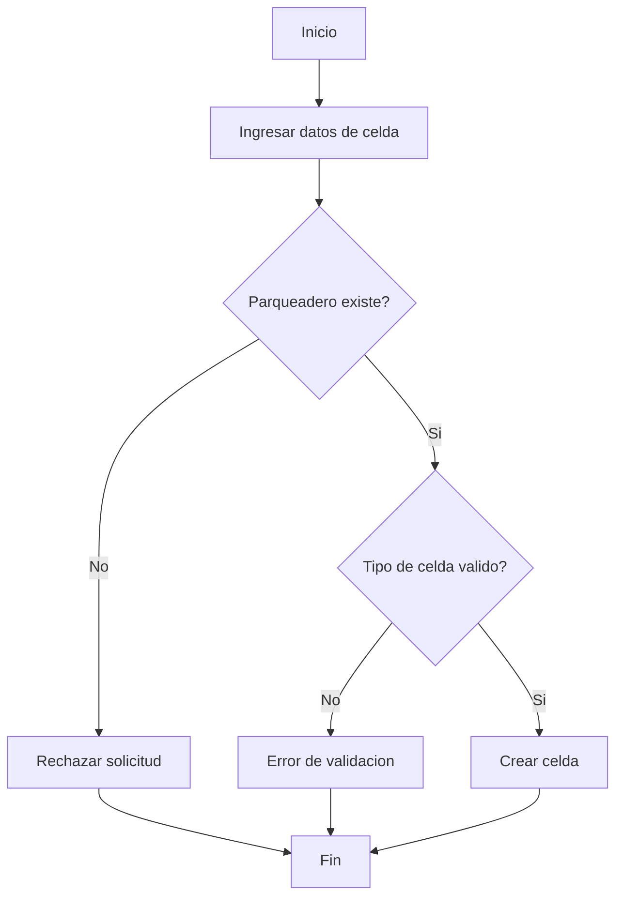
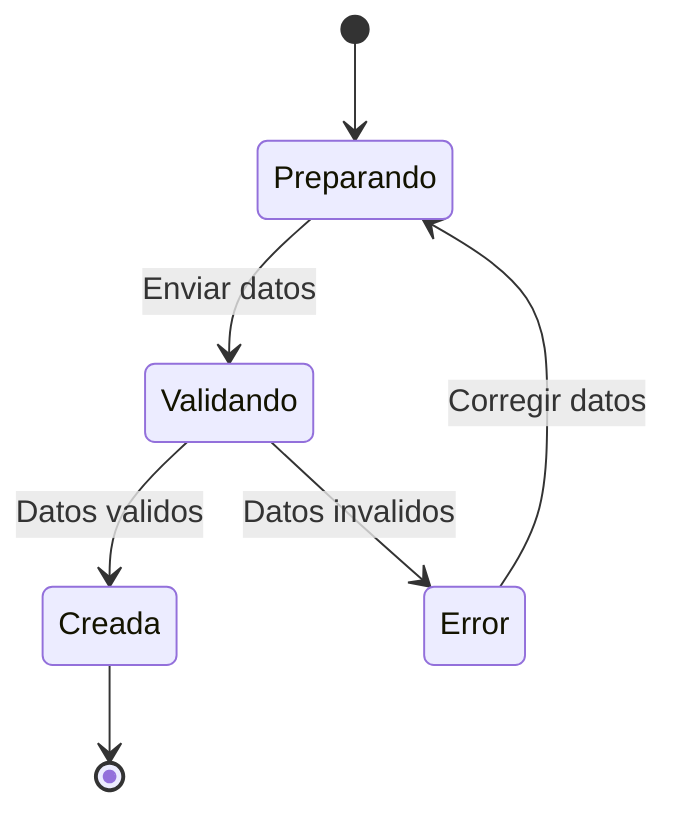
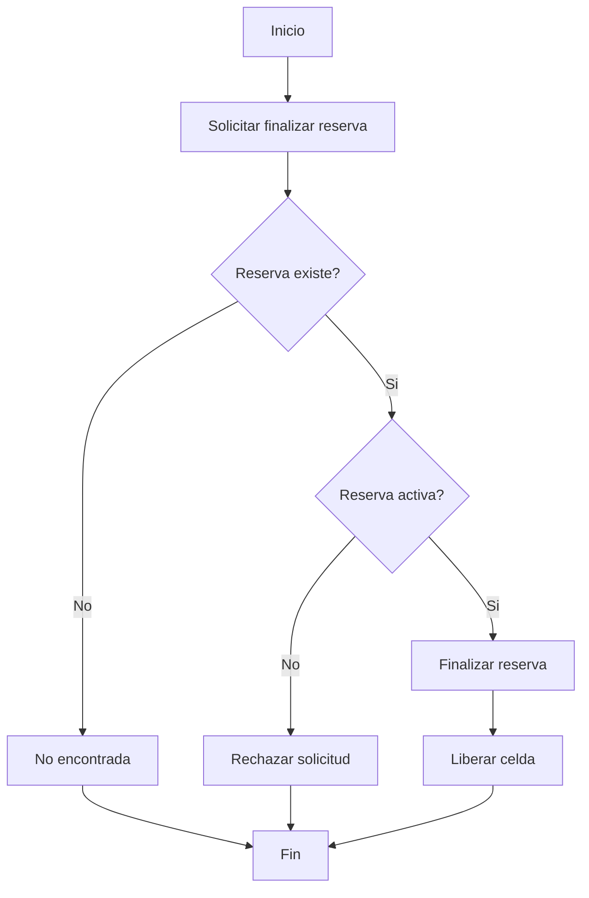
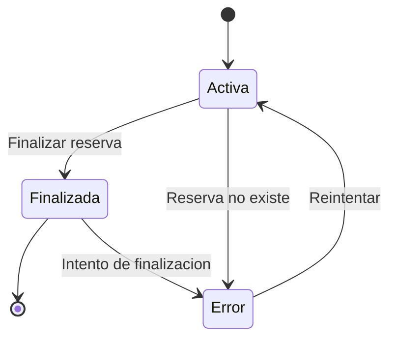
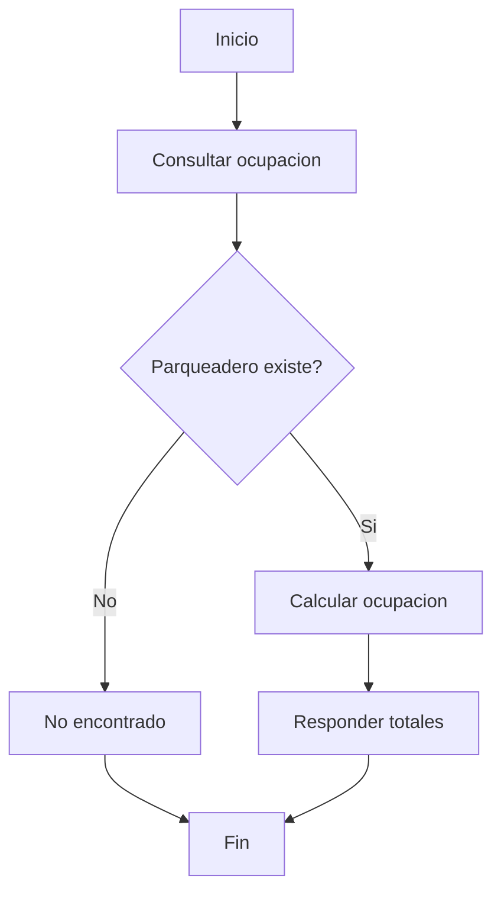
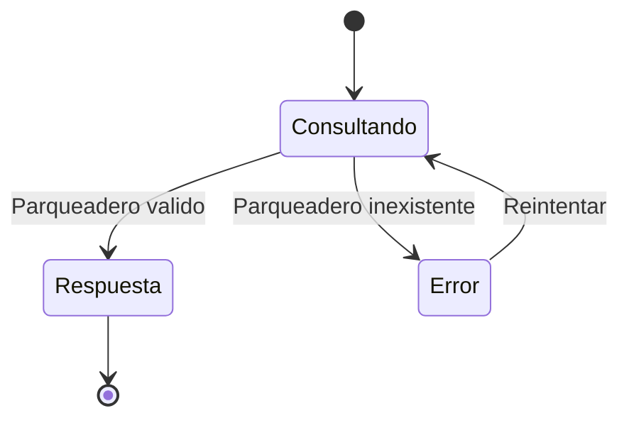
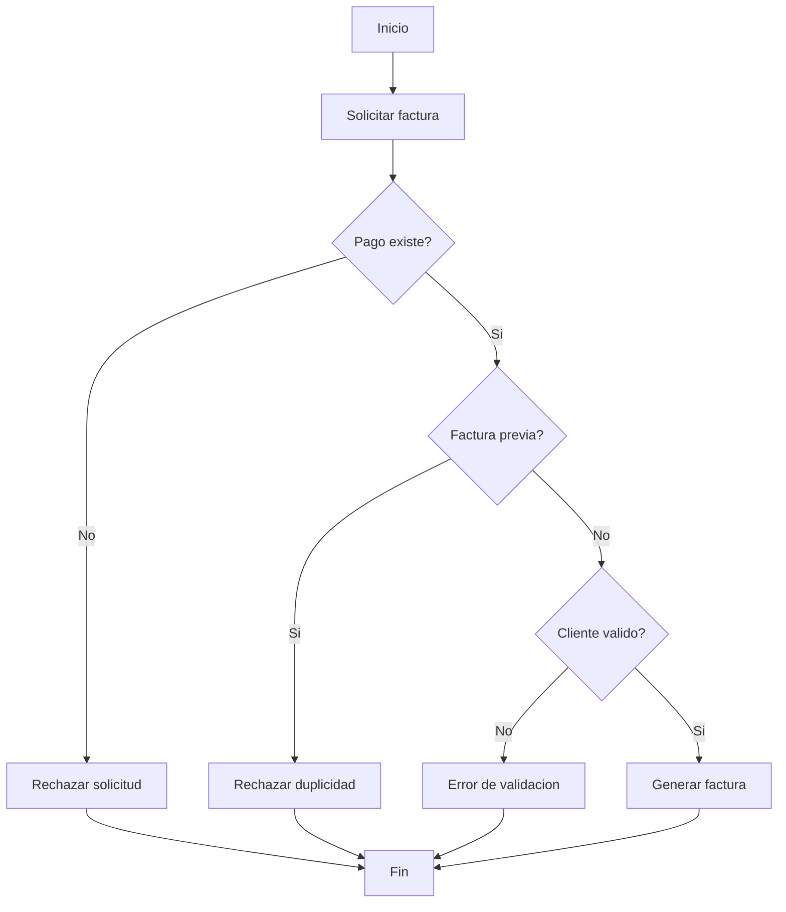
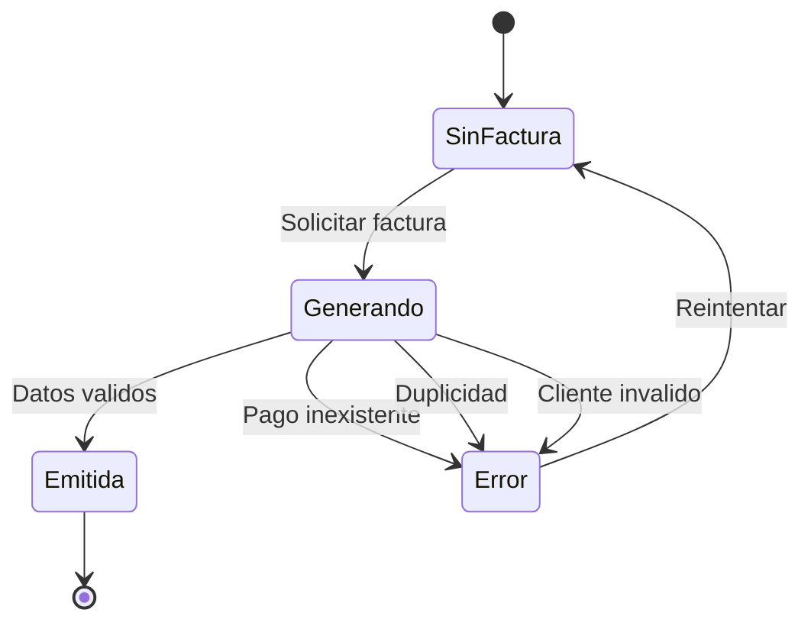

# Prueba de caja negra - Iniciar sesion

## Funcionalidad
Iniciar sesion en el sistema con correo y contrasena.

## HU relacionada
HU-02: Iniciar sesion

## Parametros definidos
- Correo valido: ema1001cano@gmail.com
- Contrasena valida: Prueba1.
- Correo invalido: ema1010@gmail.com
- Contrasena invalida: prueba1.
- Campos vacios: correo vacio y contrasena vacia

## Descripcion de la prueba
La prueba verifica el comportamiento observable del sistema ante intentos de inicio de sesion con datos validos e invalidos. No se inspecciona la implementacion interna, solo las respuestas del sistema, los mensajes de error y el resultado final (acceso concedido o rechazado).

## Casos de prueba (caja negra)
1. Credenciales validas: acceso exitoso.
2. Correo invalido: acceso rechazado.
3. Contrasena invalida: acceso rechazado.
4. Campos vacios: error de validacion.

## Grafico de pruebas (flujo)

## Grafo de pruebas (transiciones de estado)

# Prueba de caja negra - Crear celda

## Funcionalidad
Crear celda en el sistema para un parqueadero existente.

## HU relacionada
HU-06: Crear celda

## Parametros definidos
- Parqueadero existente: idParqueadero valido
- Parqueadero inexistente: idParqueadero invalido
- Tipo de celda invalido
- Datos validos (celda creada)

## Descripcion de la prueba
La prueba verifica que el sistema permita crear una celda cuando el parqueadero existe y los datos son validos. El sistema debe rechazar parqueaderos inexistentes o tipos de celda invalidos.

## Casos de prueba (caja negra)
1. Parqueadero inexistente: rechazo.
2. Tipo de celda invalido: error de validacion.
3. Datos validos: celda creada.
4. Datos obligatorios vacios: error de validacion.

## Grafico de pruebas (flujo)

## Grafo de pruebas (transiciones de estado)

# Prueba de caja negra - Finalizar reserva

## Funcionalidad
Finalizar una reserva activa en el sistema y liberar la celda asociada.

## HU relacionada
HU-14: Finalizar reserva

## Parametros definidos
- Reserva activa: idReserva valido
- Reserva finalizada: idReserva en estado finalizada
- Reserva inexistente: idReserva invalido

## Descripcion de la prueba
La prueba verifica que el sistema permita finalizar reservas activas, rechace reservas finalizadas o inexistentes y libere la celda asociada.

## Casos de prueba (caja negra)
1. Reserva activa: finalizacion exitosa.
2. Reserva ya finalizada: rechazo.
3. Reserva inexistente: no encontrada.
4. Verificacion de celda liberada tras finalizar.

## Grafico de pruebas (flujo)

## Grafo de pruebas (transiciones de estado)

# Prueba de caja negra - Consultar ocupacion por parqueadero

## Funcionalidad
Consultar la ocupacion de un parqueadero en el sistema.

## HU relacionada
HU-35: Consultar ocupacion por parqueadero

## Parametros definidos
- Parqueadero existente: idParqueadero valido
- Parqueadero inexistente: idParqueadero invalido
- Parqueadero sin celdas

## Descripcion de la prueba
La prueba verifica que el sistema devuelva el nivel de ocupacion con totales de celdas y ocupadas para un parqueadero valido, y que indique error cuando no exista.

## Casos de prueba (caja negra)
1. Parqueadero con ocupacion registrada: respuesta con totales.
2. Parqueadero sin celdas: totales en cero.
3. Parqueadero inexistente: no encontrado.
4. Parqueadero de otra empresa: acceso rechazado.

## Grafico de pruebas (flujo)

## Grafo de pruebas (transiciones de estado)

# Prueba de caja negra - Generar factura electronica

## Funcionalidad
Generar una factura electronica en el sistema asociada a un pago.

## HU relacionada
HU-23: Generar factura electronica

## Parametros definidos
- Pago existente sin factura
- Pago inexistente
- Pago con factura previa
- Cliente de facturacion inexistente

## Descripcion de la prueba
La prueba verifica que el sistema genere la factura cuando el pago y cliente existen, y rechace duplicidad o datos invalidos.

## Casos de prueba (caja negra)
1. Pago existente: factura generada.
2. Pago inexistente: rechazo.
3. Pago con factura previa: rechazo.
4. Cliente inexistente: error.
5. Datos obligatorios incompletos: error de validacion.

## Grafico de pruebas (flujo)

## Grafo de pruebas (transiciones de estado)

