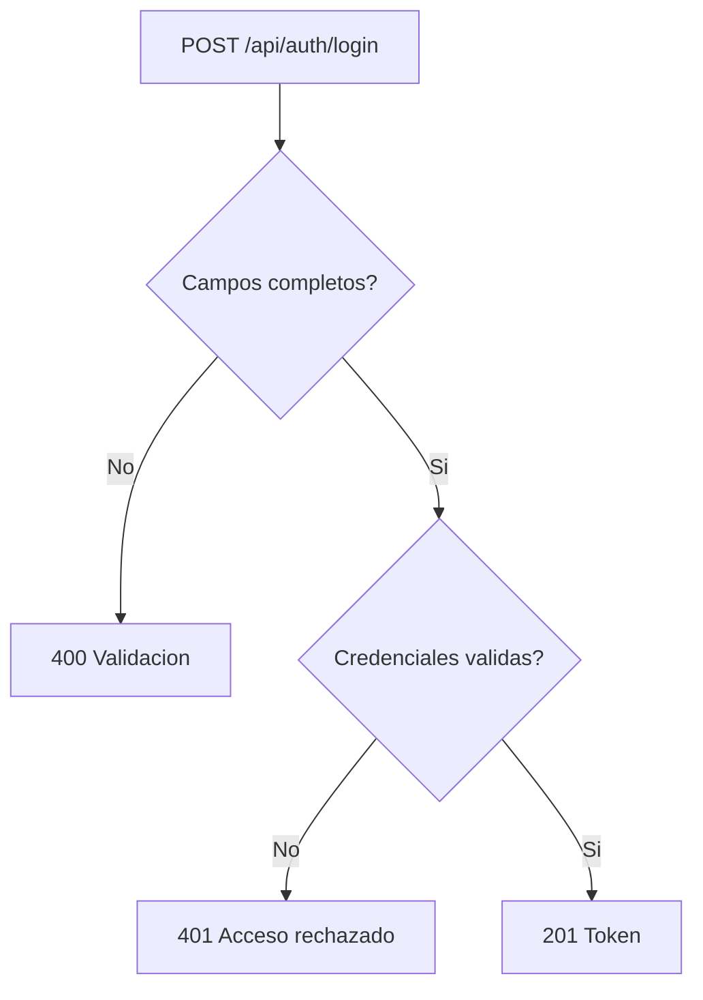
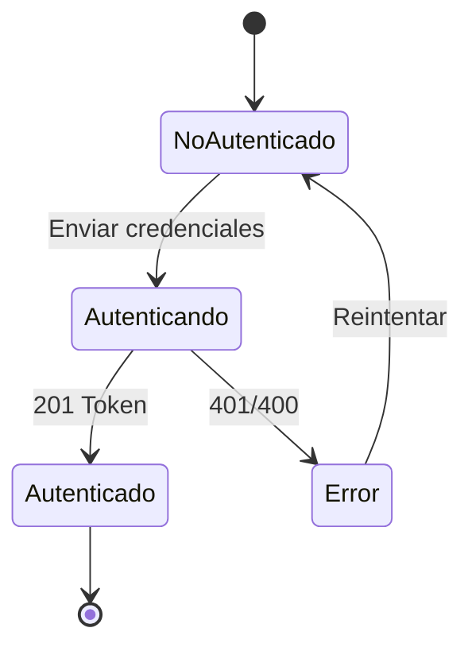
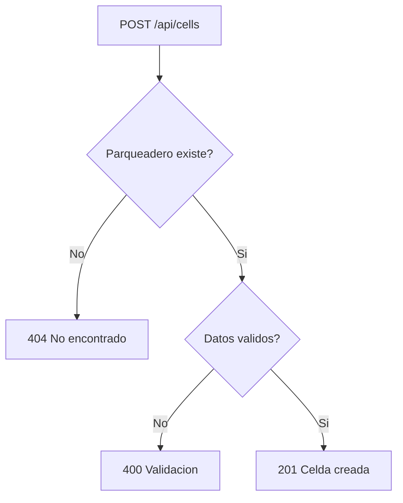
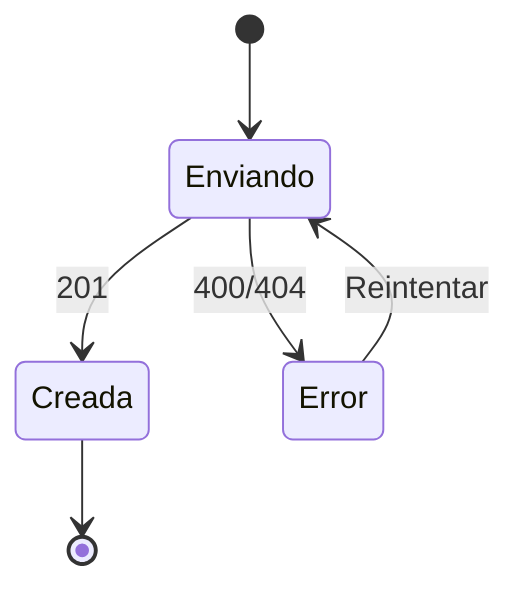
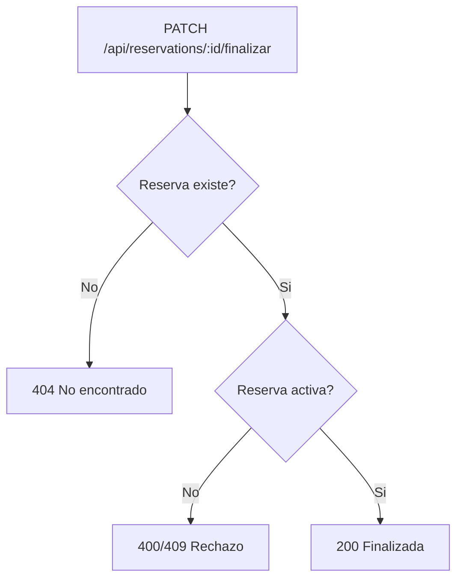
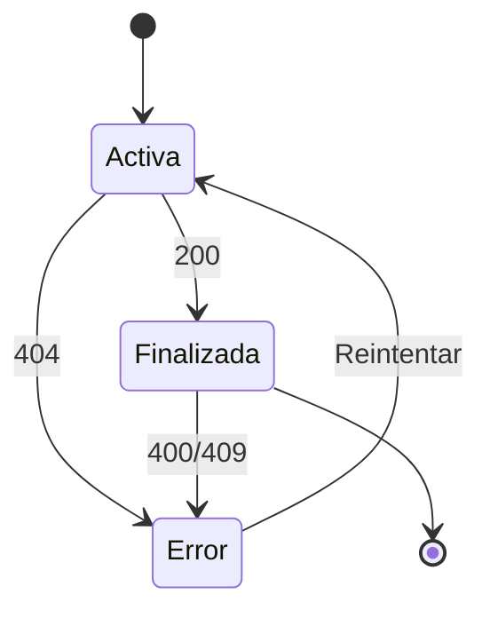
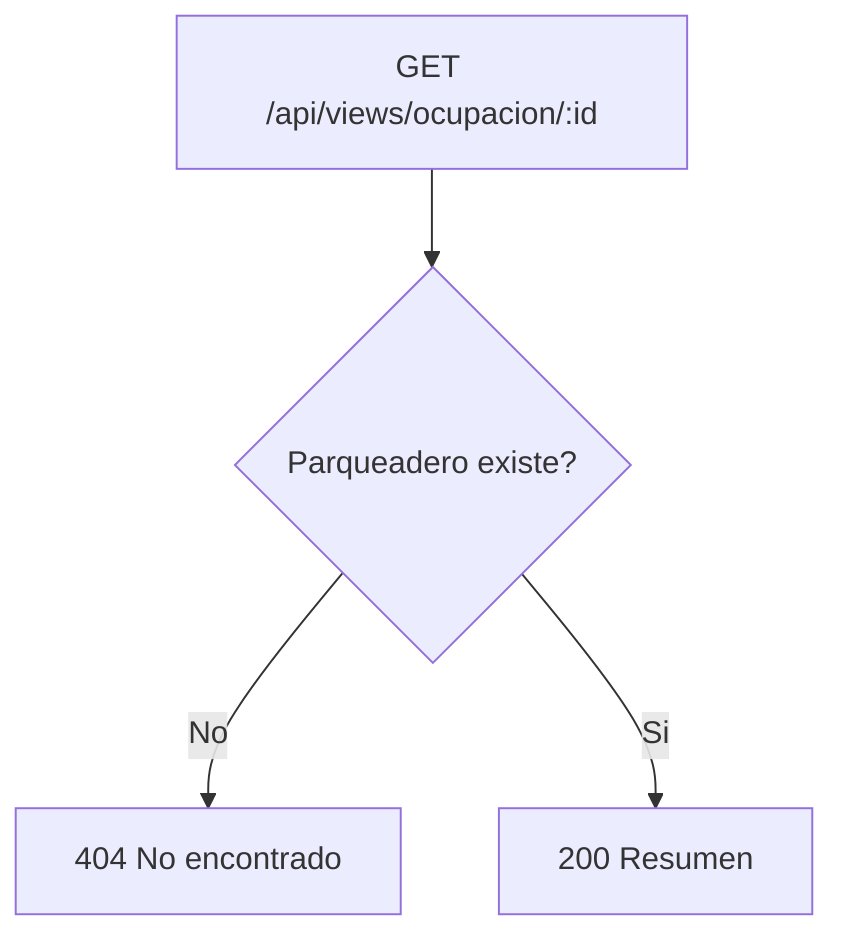
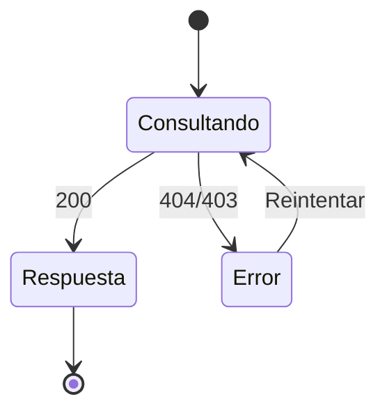
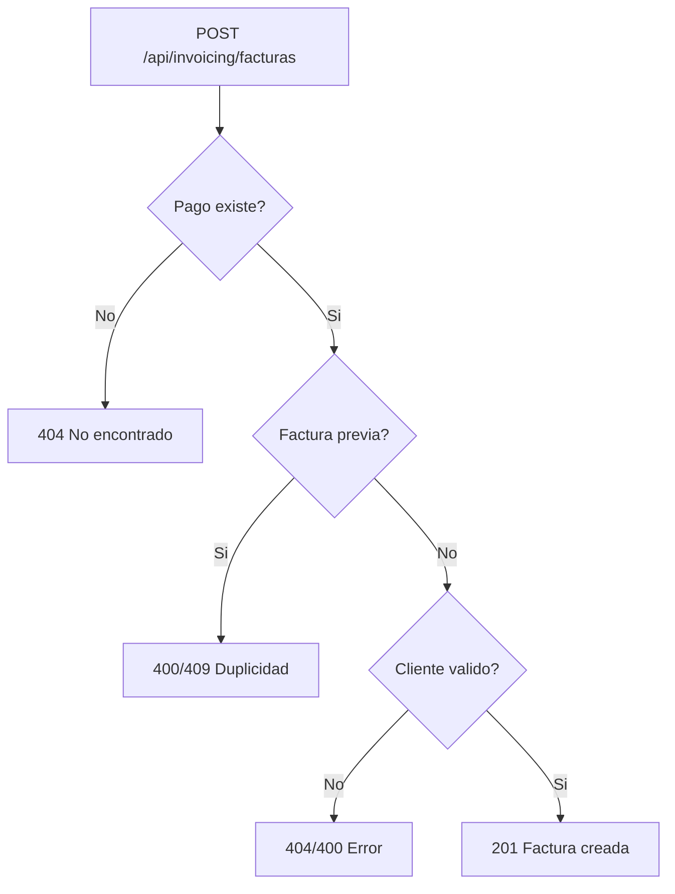
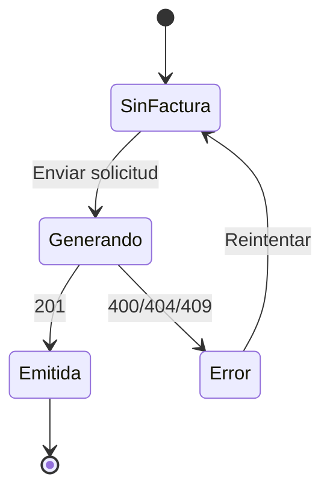

# Pruebas de caja negra - Backend por funcionalidad

> Este documento detalla casos de prueba backend (API REST) para las funcionalidades documentadas en prueba_caja_negra_login.md, incluyendo endpoints y codigos de respuesta esperados.

# Funcionalidad: Iniciar sesion (backend)

## Endpoint
POST /api/auth/login

## HU relacionada
HU-02: Iniciar sesion

## Descripcion de la prueba
Se valida la respuesta del sistema ante credenciales validas e invalidas, sin inspeccionar la implementacion interna. Se verifican codigos de estado y estructura de respuesta.

## Casos de prueba (caja negra)
1. Credenciales validas: 201 + respuesta con access_token.
2. Correo invalido: 401 + mensaje de acceso rechazado.
3. Contrasena invalida: 401 + mensaje de acceso rechazado.
4. Campos vacios: 400 + errores de validacion.

## Grafico de pruebas (flujo)

## Grafo de pruebas (transiciones de estado)

# Funcionalidad: Crear celda (backend)

## Endpoint
POST /api/cells

## HU relacionada
HU-06: Crear celda

## Descripcion de la prueba
Se valida la creacion de una celda asociada a un parqueadero existente. Se revisan errores por parqueadero inexistente, tipo invalido o datos incompletos.

## Casos de prueba (caja negra)
1. Parqueadero inexistente: 404.
2. Tipo de celda invalido: 400.
3. Datos validos: 201 + celda creada.
4. Datos obligatorios vacios: 400.

## Grafico de pruebas (flujo)

## Grafo de pruebas (transiciones de estado)

# Funcionalidad: Finalizar reserva (backend)

## Endpoint
PATCH /api/reservations/:id/finalizar

## HU relacionada
HU-14: Finalizar reserva

## Descripcion de la prueba
Se valida que una reserva activa pueda finalizarse y que el sistema responda correctamente ante reservas inexistentes o ya finalizadas.

## Casos de prueba (caja negra)
1. Reserva activa: 200 + reserva finalizada.
2. Reserva ya finalizada: 400 o 409 (segun validacion).
3. Reserva inexistente: 404.
4. Verificacion de celda liberada: 200 y estado de celda libre.

## Grafico de pruebas (flujo)

## Grafo de pruebas (transiciones de estado)

# Funcionalidad: Consultar ocupacion por parqueadero (backend)

## Endpoint
GET /api/views/ocupacion/:idParqueadero

## HU relacionada
HU-35: Consultar ocupacion por parqueadero

## Descripcion de la prueba
Se valida que el sistema responda con el resumen de ocupacion para un parqueadero valido, y con error para parqueadero inexistente.

## Casos de prueba (caja negra)
1. Parqueadero con ocupacion registrada: 200 + totales.
2. Parqueadero sin celdas: 200 + totales en cero.
3. Parqueadero inexistente: 404.
4. Parqueadero de otra empresa: 403 (si aplica restriccion por empresa).

## Grafico de pruebas (flujo)

## Grafo de pruebas (transiciones de estado)

# Funcionalidad: Generar factura electronica (backend)

## Endpoint
POST /api/invoicing/facturas

## HU relacionada
HU-23: Generar factura electronica

## Descripcion de la prueba
Se valida la generacion de factura para un pago existente y el rechazo ante pagos inexistentes, duplicados o datos incompletos.

## Casos de prueba (caja negra)
1. Pago existente sin factura: 201 + factura creada.
2. Pago inexistente: 404.
3. Pago con factura previa: 409 o 400 (segun validacion).
4. Cliente inexistente: 404.
5. Datos obligatorios incompletos: 400.

## Grafico de pruebas (flujo)

## Grafo de pruebas (transiciones de estado)

